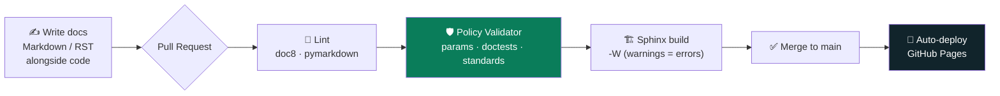
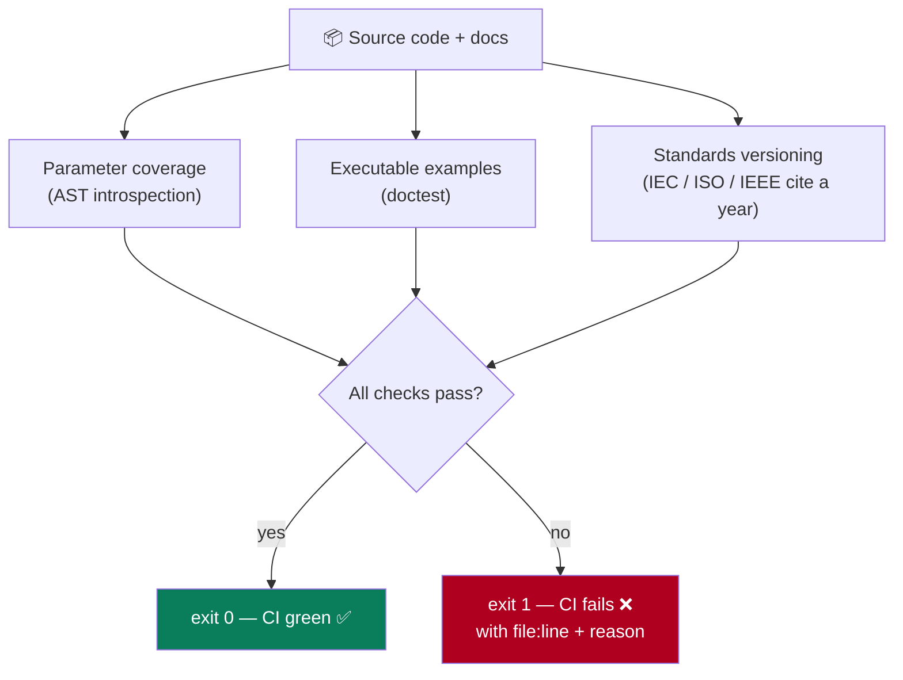
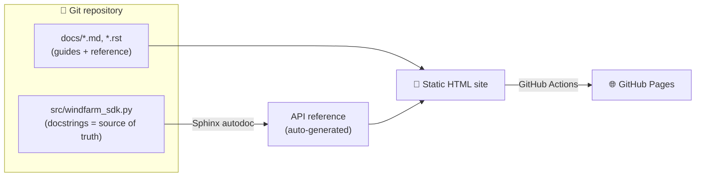

# DocsAsCode

> A **docs-as-code platform** that treats documentation like software — version-controlled, automatically validated, and continuously deployed. Demonstrated on a regulated (offshore-wind) SDK, but the engine is domain-agnostic.


---

## What is this?

Documentation rots because nothing enforces its quality. Links break, code examples
go stale, API parameters get added but never documented — and nobody notices until a
user hits the gap. **DocsAsCode** fixes that by putting documentation through the same
discipline as production code: it lives in Git, every change runs through an automated
quality gate, and the published site rebuilds itself on every merge.

The headline feature is a **custom documentation-policy validator** that checks the
things off-the-shelf linters can't: not just *style*, but *substance*.

---

## The pipeline at a glance



Nothing reaches the live site unless it lints clean, passes the policy gate, and builds
with zero warnings.

---

## The differentiator: a documentation-policy validator

Generic linters check formatting — line length, heading levels, trailing whitespace.
They cannot tell you whether your docs are *correct*. `tools/validate_docs.py` does, by
introspecting the actual source with Python's AST and executing examples for real.



| Rule | What it enforces | Why it matters |
|------|------------------|----------------|
| **Parameter coverage** | Every public function/method documents *all* its parameters | Catches the silent drift where code gains a parameter the docs never mention |
| **Executable examples** | `doctest` snippets in the source actually run | A copy-paste example that no longer works is worse than none |
| **Standards versioning** | References to engineering standards must cite an edition/year | An uncited standard (e.g. `IEC 61400` vs `IEC 61400-1:2019`) is a compliance risk |

Rules are configurable in `.docpolicy.json`.

### What it catches

```diff
- def compliance_report(self, site_id, standard):   # ❌ params undocumented
-     """Generate a compliance summary."""
+ def compliance_report(self, site_id, standard="IEC 61400-1:2019"):
+     """Generate a compliance summary.
+
+     :param site_id: Identifier of the wind farm site.   # ✅ now documented
+     :param standard: Standard to assess against, incl. edition/year.
+     """
```

The validator even caught a bare standard reference in this repo's own compliance
guide during development — exactly the failure mode it exists to prevent.

---

## Architecture



The API reference is **generated from docstrings** — edit the code, and the docs page
updates on the next build. No manual sync, no drift.

---

## Tech stack

| Tool | Role |
|------|------|
| **Sphinx** | Documentation generation engine |
| **MyST Parser** | Markdown authoring inside Sphinx |
| **Read the Docs theme** | Developer-portal styling |
| **GitHub Actions** | CI (lint + validate + build) and CD (deploy) |
| **doc8 / pymarkdown** | RST / Markdown linting |
| **linkchecker** | Broken-link detection |
| **Custom validator** | Param coverage · doctests · standards versioning |

---

## Quick start

```bash
git clone https://github.com/RithikPorandla/DocsAsCode-Platform
cd DocsAsCode-Platform
pip install -r requirements.txt

python tools/validate_docs.py   # run the policy gate
cd docs && make html            # build the site
```

Then open `docs/_build/html/index.html`. Live build: **https://RithikPorandla.github.io/DocsAsCode-Platform**

---

## Repository layout

```
.
├── .github/workflows/    # CI (lint + validate + build) and CD (deploy)
├── docs/                 # Documentation source
│   ├── conf.py           # Sphinx config
│   ├── index.rst         # Docs homepage
│   ├── getting-started.md
│   ├── compliance.md     # Guide: docs-as-code for compliance
│   └── _static/          # Custom theme accents
├── src/
│   └── windfarm_sdk.py   # Example SDK, auto-documented from docstrings
├── tools/
│   └── validate_docs.py  # ⭐ Custom documentation-policy validator
├── .docpolicy.json       # Validator configuration
└── requirements.txt
```

---

## How the pipeline works

1. **Write** — Docs live in `/docs` as Markdown or RST, version-controlled beside the code.
2. **Validate** — Every pull request runs linting, link checking, and the custom policy gate.
3. **Build** — Sphinx compiles the docs and auto-generates the API reference (`-W`: a single warning fails the build).
4. **Deploy** — A merge to `main` rebuilds and publishes to GitHub Pages automatically.

---

## Setup notes

One-time, to enable auto-deploy: **Settings → Pages → Build and deployment → Source → GitHub Actions**.

## Honest scope

This is a developer-experience / tooling project. The wind SDK is a believable *demo
domain*, not a product claim — the validator's standards rule applies equally to
aerospace (`DO-178C`), automotive (`ISO 26262:2018`), or medical-device documentation.
The transferable idea is automated documentation *quality enforcement* in CI.
